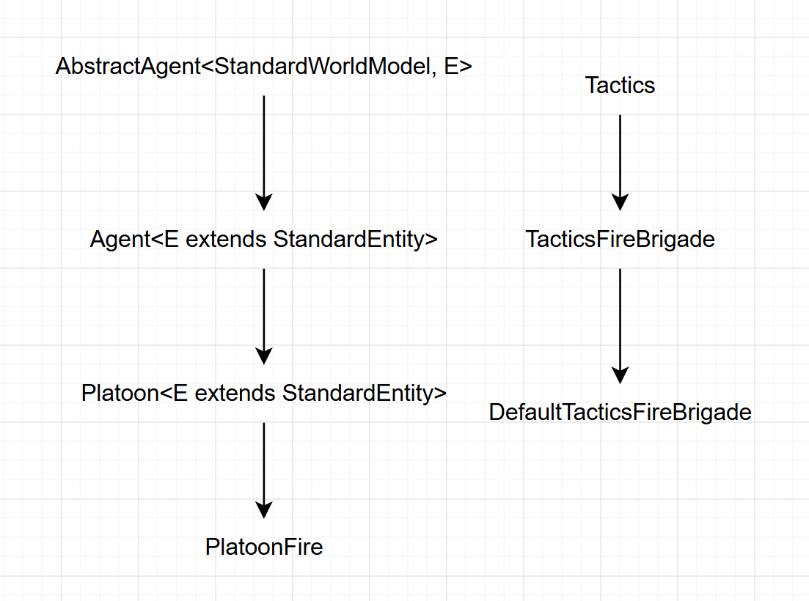

1.为什么‘agent'要声明’abstract'
    因为在Agent中有要声明的抽象方法：getRequestedEntityURNsEnum和think，
    所以 Agent 只能作为模板基类存在，不能直接实例化，必须声明为 abstract。
2.`Tactics.java` 中的 `think()` 方法和 `Agent.java` 中的 `think()` 方法是什么关系
    Agent调用Tactics来完成具体决策
3.什么叫"策略模式"？在本项目中体现在哪里？
    策略模式是定义一系列算法（策略），使它们可以互相替换，客户端无需知道具体使用哪个策略
    体现：Tactics是策略接口，所有具体策略都继承它，实现不同的决策逻辑

